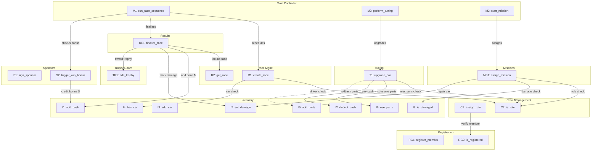

# Call Graph Visual Layout Guide (Part 2.1)

Use this Mermaid diagram as the blueprint for your **Hand-Drawn Call Graph**.
Every arrow below has been verified against the actual source code.

### **Integration Path Visualizer**

### **Drawing Instructions for Hand-Drawn Version:**

1.  **Modules = Boxes**: Draw 10 boxes (one per module). Each box is labeled with the module name.
2.  **Functions = Circles**: Inside each box, draw a circle for each function node (e.g., `R1`, `R2` inside the "Race Mgmt" box).
3.  **Arrows = Solid Lines**: Draw a solid arrow from the caller circle to the callee circle. Label each arrow with the action (e.g., "driver check").
4.  **Rollback = Dashed Line**: The `T1 -> I5` rollback should be drawn as a **dashed arrow** to indicate it's a conditional/error path.
5.  **Grouping**: Place the "Main Controller" box at the top, with arrows fanning downward to Race, Results, Sponsors, Tuning, and Missions. Place Inventory and Crew at the bottom since they are the most-called modules.
6.  **Cross-Module Highlighting**: Use a different color (e.g., red) for arrows that cross module boundaries to clearly show "inter-module" calls.
